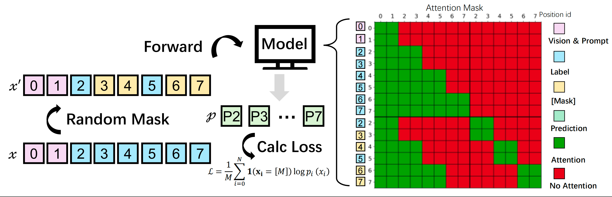

<p align="center">
  
</p>

# MinerU-Diffusion

<p align="center">
  
  
  
  
  
  
  
  <br><br>
  <a href="./docs/MinerU-Diffusion-V1.pdf"></a>
  <a href="https://huggingface.co/opendatalab/MinerU-Diffusion-V1-0320-2.5B"></a>
  <a href="https://yinjjiew.github.io/projects/openclawrl1"></a>
  <a href="https://github.com/sgl-project/sglang"></a>
  <a href="https://github.com/GeeeekExplorer/nano-vllm"></a>
  <a href="LICENSE"></a>
</p>

<p align="center">
  <video src="https://github.com/user-attachments/assets/0d203a40-4503-436d-876f-f70354bd1e63" controls width="200" align="center"></video>
</p>


## 📰 News

- **[2026/3/24]** 🔥 We release **MinerU-Diffusion-V1** — a 2.5B diffusion-based framework for document OCR that
replaces autoregressive decoding with block-level parallel diffusion decoding.

## 🎯 Roadmap

Our long-term goal is to **build efficient and reliable diffusion-based decoding for document OCR**. 

- ✅ **Release MinerU-Diffusion-V1:** A diffusion-based framework for document OCR that replaces autoregressive decoding with block-level parallel diffusion decoding.
- ✅ Support [SGLang](https://github.com/sgl-project/sglang) to accommodate diffusion computation.
- ✅ Complete the [Nano-vLLM](https://github.com/GeeeekExplorer/nano-vllm) adaptation used by our `nano_dvlm` engine for single-GPU inference.
- ✅ Complete the Gradio-based interactive demo implementation.
- ⬜ Release MinerU-Diffusion-V2: More Small, More Faster, More Elegant, More Powerful!
- ⬜ Release Training Code

---

## 💡 TL;DR

> **MinerU-Diffusion** reframes document OCR as an inverse rendering problem and replaces slow, error-prone autoregressive decoding with parallel diffusion decoding.

By introducing block-wise diffusion, uncertainty-driven curriculum learning, it achieves up to 3.2× faster decoding while improving robustness and reducing reliance on language priors.

<p align="center">
  
</p>

<p align="center">
  <em>Diffusion decoding progressively reconstructs structured text from masked tokens under visual conditioning: black tokens are confirmed, red tokens are being updated, and yellow tokens remain masked, enabling parallel generation with global consistency, in contrast to autoregressive left-to-right decoding.</em>
</p>

<p align="center">
  
</p>

<p align="center">
  <em>Training of MinerU-Diffusion. Left: the target token sequence is randomly masked to form a partially observed input, and the model predicts only the masked positions under visual and prompt conditioning. Right: the structured block-attention mask used during training, where tokens attend bidirectionally within each block and causally to all preceding blocks, enabling parallel diffusion refinement within blocks while preserving coarse autoregressive structure across blocks.</em>
</p>

## 📈 Performance

<p align="center">
  
</p>

MinerU-Diffusion provides a flexible accuracy-throughput trade-off through threshold control. Compared with MinerU2.5, it achieves up to **3.26x** TPS, while also offering practical operating points such as **2.12x speedup with 99.9% relative accuracy** and **3.01x speedup with 98.8% relative accuracy**.

## 🗂️ Repository Layout

```text
MinerU-Diffusion/
├── .gitignore
├── assets/
│   ├── banner.png
│   ├── decode.png
│   ├── homepage-demo.mp4
│   ├── image.png
│   ├── performance_tradeoff.jpeg
│   └── train.png
├── docs/
│   ├── MinerU-Diffusion-V1.pdf
│   ├── gradio/
│   │   ├── app.py
│   │   ├── diffusion_hf.py
│   │   ├── mineru_hf.py
│   │   └── speed_compare/
│   └── sglang/
│       ├── README.md
│       ├── mineru_request.py
│       ├── run_infer.sh
│       └── run_server.sh
├── engines/
│   ├── __init__.py
│   ├── hf/
│   │   ├── __init__.py
│   │   └── runner.py
│   ├── nano_dvlm/
│   │   ├── nanovllm/
│   │   ├── __init__.py
│   │   ├── bench.py
│   │   ├── example.py
│   │   └── pyproject.toml
│   └── sglang/
│       └── __init__.py
├── mineru_diffusion/
│   ├── __init__.py
│   ├── configuration_mineru_diffusion.py
│   ├── modeling_mineru_diffusion.py
│   ├── processing_mineru_diffusion.py
│   └── utils/
│       ├── __init__.py
│       └── bbox.py
├── requirements.txt
├── scripts/
│   ├── run_inference.py
│   ├── run_inference.sh
│   └── run_sglang_server.sh
├── LICENSE
└── README.md
```

## 🌐 Online Experience

### Official online web application
The official web application provides a more complete product experience, including a polished interface and richer features. Login is required.
 
- [![OpenDataLab](https://img.shields.io/badge/webapp_on_mineru.net-blue?logo=data:image/svg+xml;base64,PHN2ZyB3aWR0aD0iMTM0IiBoZWlnaHQ9IjEzNCIgeG1sbnM9Imh0dHA6Ly93d3cudzMub3JnLzIwMDAvc3ZnIj48cGF0aCBkPSJtMTIyLDljMCw1LTQsOS05LDlzLTktNC05LTksNC05LDktOSw5LDQsOSw5eiIgZmlsbD0idXJsKCNhKSIvPjxwYXRoIGQ9Im0xMjIsOWMwLDUtNCw5LTksOXMtOS00LTktOSw0LTksOS05LDksNCw5LDl6IiBmaWxsPSIjMDEwMTAxIi8+PHBhdGggZD0ibTkxLDE4YzAsNS00LDktOSw5cy05LTQtOS05LDQtOSw5LTksOSw0LDksOXoiIGZpbGw9InVybCgjYikiLz48cGF0aCBkPSJtOTEsMThjMCw1LTQsOS05LDlzLTktNC05LTksNC05LDktOSw5LDQsOSw5eiIgZmlsbD0iIzAxMDEwMSIvPjxwYXRoIGZpbGwtcnVsZT0iZXZlbm9kZCIgY2xpcC1ydWxlPSJldmVub2RkIiBkPSJtMzksNjJjMCwxNiw4LDMwLDIwLDM4LDctNiwxMi0xNiwxMi0yNlY0OWMwLTQsMy03LDYtOGw0Ni0xMmM1LTEsMTEsMywxMSw4djMxYzAsMzctMzAsNjYtNjYsNjYtMzcsMC02Ni0zMC02Ni02NlY0NmMwLTQsMy03LDYtOGwyMC02YzUtMSwxMSwzLDExLDh2MjF6bS0yOSw2YzAsMTYsNiwzMCwxNyw0MCwzLDEsNSwxLDgsMSw1LDAsMTAtMSwxNS0zQzM3LDk1LDI5LDc5LDI5LDYyVjQybC0xOSw1djIweiIgZmlsbD0idXJsKCNjKSIvPjxwYXRoIGZpbGwtcnVsZT0iZXZlbm9kZCIgY2xpcC1ydWxlPSJldmVub2RkIiBkPSJtMzksNjJjMCwxNiw4LDMwLDIwLDM4LDctNiwxMi0xNiwxMi0yNlY0OWMwLTQsMy03LDYtOGw0Ni0xMmM1LTEsMTEsMywxMSw4djMxYzAsMzctMzAsNjYtNjYsNjYtMzcsMC02Ni0zMC02Ni02NlY0NmMwLTQsMy03LDYtOGwyMC02YzUtMSwxMSwzLDExLDh2MjF6bS0yOSw2YzAsMTYsNiwzMCwxNyw0MCwzLDEsNSwxLDgsMSw1LDAsMTAtMSwxNS0zQzM3LDk1LDI5LDc5LDI5LDYyVjQybC0xOSw1djIweiIgZmlsbD0iIzAxMDEwMSIvPjxkZWZzPjxsaW5lYXJHcmFkaWVudCBpZD0iYSIgeDE9Ijg0IiB5MT0iNDEiIHgyPSI3NSIgeTI9IjEyMCIgZ3JhZGllbnRVbml0cz0idXNlclNwYWNlT25Vc2UiPjxzdG9wIHN0b3AtY29sb3I9IiNmZmYiLz48c3RvcCBvZmZzZXQ9IjEiIHN0b3AtY29sb3I9IiMyZTJlMmUiLz48L2xpbmVhckdyYWRpZW50PjxsaW5lYXJHcmFkaWVudCBpZD0iYiIgeDE9Ijg0IiB5MT0iNDEiIHgyPSI3NSIgeTI9IjEyMCIgZ3JhZGllbnRVbml0cz0idXNlclNwYWNlT25Vc2UiPjxzdG9wIHN0b3AtY29sb3I9IiNmZmYiLz48c3RvcCBvZmZzZXQ9IjEiIHN0b3AtY29sb3I9IiMyZTJlMmUiLz48L2xpbmVhckdyYWRpZW50PjxsaW5lYXJHcmFkaWVudCBpZD0iYyIgeDE9Ijg0IiB5MT0iNDEiIHgyPSI3NSIgeTI9IjEyMCIgZ3JhZGllbnRVbml0cz0idXNlclNwYWNlT25Vc2UiPjxzdG9wIHN0b3AtY29sb3I9IiNmZmYiLz48c3RvcCBvZmZzZXQ9IjEiIHN0b3AtY29sb3I9IiMyZTJlMmUiLz48L2xpbmVhckdyYWRpZW50PjwvZGVmcz48L3N2Zz4=&labelColor=white)](https://mineru.net/OpenSourceTools/Extractor?source=github)

### Gradio-based online demo
A lightweight Gradio WebUI for trying the core parsing workflow. No login is required.

- [![ModelScope](https://img.shields.io/badge/Demo_on_ModelScope-purple?logo=data:image/svg+xml;base64,PHN2ZyB3aWR0aD0iMjIzIiBoZWlnaHQ9IjIwMCIgeG1sbnM9Imh0dHA6Ly93d3cudzMub3JnLzIwMDAvc3ZnIj4KCiA8Zz4KICA8dGl0bGU+TGF5ZXIgMTwvdGl0bGU+CiAgPHBhdGggaWQ9InN2Z18xNCIgZmlsbD0iIzYyNGFmZiIgZD0ibTAsODkuODRsMjUuNjUsMGwwLDI1LjY0OTk5bC0yNS42NSwwbDAsLTI1LjY0OTk5eiIvPgogIDxwYXRoIGlkPSJzdmdfMTUiIGZpbGw9IiM2MjRhZmYiIGQ9Im05OS4xNCwxMTUuNDlsMjUuNjUsMGwwLDI1LjY1bC0yNS42NSwwbDAsLTI1LjY1eiIvPgogIDxwYXRoIGlkPSJzdmdfMTYiIGZpbGw9IiM2MjRhZmYiIGQ9Im0xNzYuMDksMTQxLjE0bC0yNS42NDk5OSwwbDAsMjIuMTlsNDcuODQsMGwwLC00Ny44NGwtMjIuMTksMGwwLDI1LjY1eiIvPgogIDxwYXRoIGlkPSJzdmdfMTciIGZpbGw9IiMzNmNmZDEiIGQ9Im0xMjQuNzksODkuODRsMjUuNjUsMGwwLDI1LjY0OTk5bC0yNS42NSwwbDAsLTI1LjY0OTk5eiIvPgogIDxwYXRoIGlkPSJzdmdfMTgiIGZpbGw9IiMzNmNmZDEiIGQ9Im0wLDY0LjE5bDI1LjY1LDBsMCwyNS42NWwtMjUuNjUsMGwwLC0yNS42NXoiLz4KICA8cGF0aCBpZD0ic3ZnXzE5IiBmaWxsPSIjNjI0YWZmIiBkPSJtMTk4LjI4LDg5Ljg0bDI1LjY0OTk5LDBsMCwyNS42NDk5OWwtMjUuNjQ5OTksMGwwLC0yNS42NDk5OXoiLz4KICA8cGF0aCBpZD0ic3ZnXzIwIiBmaWxsPSIjMzZjZmQxIiBkPSJtMTk4LjI4LDY0LjE5bDI1LjY0OTk5LDBsMCwyNS42NWwtMjUuNjQ5OTksMGwwLC0yNS42NXoiLz4KICA8cGF0aCBpZD0ic3ZnXzIxIiBmaWxsPSIjNjI0YWZmIiBkPSJtMTUwLjQ0LDQybDAsMjIuMTlsMjUuNjQ5OTksMGwwLDI1LjY1bDIyLjE5LDBsMCwtNDcuODRsLTQ3Ljg0LDB6Ii8+CiAgPHBhdGggaWQ9InN2Z18yMiIgZmlsbD0iIzM2Y2ZkMSIgZD0ibTczLjQ5LDg5Ljg0bDI1LjY1LDBsMCwyNS42NDk5OWwtMjUuNjUsMGwwLC0yNS42NDk5OXoiLz4KICA8cGF0aCBpZD0ic3ZnXzIzIiBmaWxsPSIjNjI0YWZmIiBkPSJtNDcuODQsNjQuMTlsMjUuNjUsMGwwLC0yMi4xOWwtNDcuODQsMGwwLDQ3Ljg0bDIyLjE5LDBsMCwtMjUuNjV6Ii8+CiAgPHBhdGggaWQ9InN2Z18yNCIgZmlsbD0iIzYyNGFmZiIgZD0ibTQ3Ljg0LDExNS40OWwtMjIuMTksMGwwLDQ3Ljg0bDQ3Ljg0LDBsMCwtMjIuMTlsLTI1LjY1LDBsMCwtMjUuNjV6Ii8+CiA8L2c+Cjwvc3ZnPg==&labelColor=white)](https://www.modelscope.cn/studios/OpenDataLab/MinerU)
- [![HuggingFace](https://img.shields.io/badge/Demo_on_HuggingFace-yellow.svg?logo=data:image/png;base64,iVBORw0KGgoAAAANSUhEUgAAAF8AAABYCAMAAACkl9t/AAAAk1BMVEVHcEz/nQv/nQv/nQr/nQv/nQr/nQv/nQv/nQr/wRf/txT/pg7/yRr/rBD/zRz/ngv/oAz/zhz/nwv/txT/ngv/0B3+zBz/nQv/0h7/wxn/vRb/thXkuiT/rxH/pxD/ogzcqyf/nQvTlSz/czCxky7/SjifdjT/Mj3+Mj3wMj15aTnDNz+DSD9RTUBsP0FRO0Q6O0WyIxEIAAAAGHRSTlMADB8zSWF3krDDw8TJ1NbX5efv8ff9/fxKDJ9uAAAGKklEQVR42u2Z63qjOAyGC4RwCOfB2JAGqrSb2WnTw/1f3UaWcSGYNKTdf/P+mOkTrE+yJBulvfvLT2A5ruenaVHyIks33npl/6C4s/ZLAM45SOi/1FtZPyFur1OYofBX3w7d54Bxm+E8db+nDr12ttmESZ4zludJEG5S7TO72YPlKZFyE+YCYUJTBZsMiNS5Sd7NlDmKM2Eg2JQg8awbglfqgbhArjxkS7dgp2RH6hc9AMLdZYUtZN5DJr4molC8BfKrEkPKEnEVjLbgW1fLy77ZVOJagoIcLIl+IxaQZGjiX597HopF5CkaXVMDO9Pyix3AFV3kw4lQLCbHuMovz8FallbcQIJ5Ta0vks9RnolbCK84BtjKRS5uA43hYoZcOBGIG2Epbv6CvFVQ8m8loh66WNySsnN7htL58LNp+NXT8/PhXiBXPMjLSxtwp8W9f/1AngRierBkA+kk/IpUSOeKByzn8y3kAAAfh//0oXgV4roHm/kz4E2z//zRc3/lgwBzbM2mJxQEa5pqgX7d1L0htrhx7LKxOZlKbwcAWyEOWqYSI8YPtgDQVjpB5nvaHaSnBaQSD6hweDi8PosxD6/PT09YY3xQA7LTCTKfYX+QHpA0GCcqmEHvr/cyfKQTEuwgbs2kPxJEB0iNjfJcCTPyocx+A0griHSmADiC91oNGVwJ69RudYe65vJmoqfpul0lrqXadW0jFKH5BKwAeCq+Den7s+3zfRJzA61/Uj/9H/VzLKTx9jFPPdXeeP+L7WEvDLAKAIoF8bPTKT0+TM7W8ePj3Rz/Yn3kOAp2f1Kf0Weony7pn/cPydvhQYV+eFOfmOu7VB/ViPe34/EN3RFHY/yRuT8ddCtMPH/McBAT5s+vRde/gf2c/sPsjLK+m5IBQF5tO+h2tTlBGnP6693JdsvofjOPnnEHkh2TnV/X1fBl9S5zrwuwF8NFrAVJVwCAPTe8gaJlomqlp0pv4Pjn98tJ/t/fL++6unpR1YGC2n/KCoa0tTLoKiEeUPDl94nj+5/Tv3/eT5vBQ60X1S0oZr+IWRR8Ldhu7AlLjPISlJcO9vrFotky9SpzDequlwEir5beYAc0R7D9KS1DXva0jhYRDXoExPdc6yw5GShkZXe9QdO/uOvHofxjrV/TNS6iMJS+4TcSTgk9n5agJdBQbB//IfF/HpvPt3Tbi7b6I6K0R72p6ajryEJrENW2bbeVUGjfgoals4L443c7BEE4mJO2SpbRngxQrAKRudRzGQ8jVOL2qDVjjI8K1gc3TIJ5KiFZ1q+gdsARPB4NQS4AjwVSt72DSoXNyOWUrU5mQ9nRYyjp89Xo7oRI6Bga9QNT1mQ/ptaJq5T/7WcgAZywR/XlPGAUDdet3LE+qS0TI+g+aJU8MIqjo0Kx8Ly+maxLjJmjQ18rA0YCkxLQbUZP1WqdmyQGJLUm7VnQFqodmXSqmRrdVpqdzk5LvmvgtEcW8PMGdaS23EOWyDVbACZzUJPaqMbjDxpA3Qrgl0AikimGDbqmyT8P8NOYiqrldF8rX+YN7TopX4UoHuSCYY7cgX4gHwclQKl1zhx0THf+tCAUValzjI7Wg9EhptrkIcfIJjA94evOn8B2eHaVzvBrnl2ig0So6hvPaz0IGcOvTHvUIlE2+prqAxLSQxZlU2stql1NqCCLdIiIN/i1DBEHUoElM9dBravbiAnKqgpi4IBkw+utSPIoBijDXJipSVV7MpOEJUAc5Qmm3BnUN+w3hteEieYKfRZSIUcXKMVf0u5wD4EwsUNVvZOtUT7A2GkffHjByWpHqvRBYrTV72a6j8zZ6W0DTE86Hn04bmyWX3Ri9WH7ZU6Q7h+ZHo0nHUAcsQvVhXRDZHChwiyi/hnPuOsSEF6Exk3o6Y9DT1eZ+6cASXk2Y9k+6EOQMDGm6WBK10wOQJCBwren86cPPWUcRAnTVjGcU1LBgs9FURiX/e6479yZcLwCBmTxiawEwrOcleuu12t3tbLv/N4RLYIBhYexm7Fcn4OJcn0+zc+s8/VfPeddZHAGN6TT8eGczHdR/Gts1/MzDkThr23zqrVfAMFT33Nx1RJsx1k5zuWILLnG/vsH+Fv5D4NTVcp1Gzo8AAAAAElFTkSuQmCC&labelColor=white)](https://huggingface.co/spaces/opendatalab/MinerU)
## 🛠️ Environment Setup

For a first-time setup, we recommend creating a dedicated Conda environment named `dmineru` and installing the dependencies below.

Recommended core versions:

- `Python 3.12.12`
- `torch 2.8.0+cu128`
- `torchvision 0.23.0+cu128`
- `torchaudio 2.8.0+cu128`
- `transformers 4.52.1`
- `triton 3.4.0`
- `flash-attn 2.8.3`
- `liger-kernel 0.6.4`

Create and install the environment:

```bash
conda create -n dmineru python=3.12 -y
conda activate dmineru

pip install --upgrade pip
pip install torch==2.8.0 torchvision==0.23.0 torchaudio==2.8.0 --index-url https://download.pytorch.org/whl/cu128
pip install "transformers>=4.52.1"
wget https://github.com/Dao-AILab/flash-attention/releases/download/v2.8.3/flash_attn-2.8.3+cu12torch2.8cxx11abiFALSE-cp312-cp312-linux_x86_64.whl
pip install flash_attn-2.8.3+cu12torch2.8cxx11abiFALSE-cp312-cp312-linux_x86_64.whl
pip install -r requirements.txt
```

The root-level [`requirements.txt`](./requirements.txt) covers:

- the Hugging Face inference path (`ENGINE=hf`)
- the built-in Nano-DVLM path (`ENGINE=nano_dvlm`)
- the client-side request path for the OpenAI-compatible SGLang endpoint (`ENGINE=sglang`)

Notes:

- The requirements file uses the CUDA 12.8 PyTorch wheel index and pins a tested set of core package versions for first-time setup.
- `flash-attn==2.8.3` must match your local CUDA, compiler, and PyTorch stack. If a prebuilt wheel is not available for your machine, install a compatible wheel manually or build it from source before retrying `pip install -r requirements.txt`.
- The `sglang` server binary itself is not installed by the root `requirements.txt`. If you want to run [`scripts/run_sglang_server.sh`](./scripts/run_sglang_server.sh), install `sglang` in a dedicated environment or SGLang checkout first, then follow [docs/sglang/README.md](./docs/sglang/README.md).

## 📦 Model Weights

Download the model weights before running inference, then point `MODEL_PATH` to the local checkpoint directory.

- Hugging Face: [`opendatalab/MinerU-Diffusion-V1-0320-2.5B`](https://huggingface.co/opendatalab/MinerU-Diffusion-V1-0320-2.5B)
- ModelScope: download the corresponding MinerU-Diffusion model weights from the ModelScope model hub and set `MODEL_PATH` to that local directory as well

Example:

```bash
MODEL_PATH=/path/to/MinerU-Diffusion-V1-0320-2.5B
```

## 🧩 Prompt Types

MinerU-Diffusion supports multiple prompt types for different document parsing targets. Each prompt is designed for a specific output structure rather than a single generic free-form response.

| Prompt Type | Function | Input Setting | Output Format | Example Output |
| --- | --- | --- | --- | --- |
| `Layout Detection` | Page-level layout parsing with region coordinates, category tags, and rotation direction. | Resized to `1036 x 1036`. | Bounding boxes plus element labels and rotation tags. | `<\| box_start \|>100 200 300 400<\| box_end \|> <\| ref_start \|>title<\| ref_end \|> <\| rotate_up \|>` |
| `Text Recognition` | Plain OCR text extraction. | Native resolution, `4` to `2048` image tokens. | Raw OCR text. | `The results of the analyses of the uncertainty of the field data and related assumptions are shown in Figs 13 and 14.` |
| `Formula Recognition` | Formula extraction and conversion into LaTeX. | Native resolution, `4` to `2048` image tokens. | LaTeX formula content. | `\hat{F} = \operatorname{Concat}([F_1, F_2, \dots, F_n])` |
| `Table Recognition` | Structured table extraction for downstream processing. | Native resolution, `4` to `2048` image tokens. | OTSL (Open Table Structure Language). | `<fcel> Site <fcel> Cl <fcel> NO3 <fcel> SO4 <fcel> Na ... <nl>` |

## 🚀 Inference

Replace `MODEL_PATH` and `IMAGE_PATH` with your own paths before running.

### Transformers Example

```python
import torch
from transformers import AutoModel, AutoProcessor, AutoTokenizer

model_id = "Niujunbo2002/MinerU-Diffusion-V1-0320-2.5B"
image_path = "path/to/page.png"

tokenizer = AutoTokenizer.from_pretrained(model_id, trust_remote_code=True)
processor = AutoProcessor.from_pretrained(
    model_id,
    trust_remote_code=True,
    use_fast=False,
)
model = AutoModel.from_pretrained(
    model_id,
    trust_remote_code=True,
    torch_dtype=torch.bfloat16,
    low_cpu_mem_usage=True,
).eval().to("cuda")

messages = [
    {"role": "system", "content": [{"type": "text", "text": "You are a helpful assistant."}]},
    {
        "role": "user",
        "content": [
            {"type": "image", "image": image_path},
            {"type": "text", "text": "\nText Recognition:"},
        ],
    },
]

prompt_text = processor.apply_chat_template(messages, add_generation_prompt=True)
if isinstance(prompt_text, tuple):
    prompt_text = prompt_text[0]

inputs = processor(
    images=[image_path],
    text=prompt_text,
    truncation=True,
    max_length=4096,
    return_tensors="pt",
)
input_ids = inputs["input_ids"].to(torch.long).to("cuda")
pixel_values = inputs["pixel_values"].to(torch.bfloat16).to("cuda")
image_grid_thw = inputs.get("image_grid_thw")
if image_grid_thw is not None:
    image_grid_thw = image_grid_thw.to(torch.long).to("cuda")

with torch.no_grad():
    generate_outputs = model.generate(
        pixel_values=pixel_values,
        image_grid_thw=image_grid_thw,
        input_ids=input_ids,
        mask_token_id=tokenizer.convert_tokens_to_ids("<|MASK|>"),
        denoising_steps=32,
        gen_length=1024,
        block_length=32,
        temperature=1.0,
        remasking_strategy="low_confidence_dynamic",
        dynamic_threshold=0.95,
        tokenizer=tokenizer,
        stopping_criteria=["<|endoftext|>", "<|im_end|>"],
    )

output_ids = generate_outputs[0] if isinstance(generate_outputs, tuple) else generate_outputs
text = tokenizer.decode(output_ids[0], skip_special_tokens=False)
for stop in ("<|endoftext|>", "<|im_end|>"):
    text = text.split(stop, 1)[0]

print(text.strip())
```

### HF Engine

```bash
cd /path/to/MinerU-Diffusion
ENGINE=hf \
MODEL_PATH=/path/to/MinerU-Diffusion-model \
IMAGE_PATH=/path/to/input-image.png \
bash scripts/run_inference.sh
```

### Nano-DVLM Engine

```bash
cd /path/to/MinerU-Diffusion
ENGINE=nano_dvlm \
MODEL_PATH=/path/to/MinerU-Diffusion-model \
IMAGE_PATH=/path/to/input-image.png \
bash scripts/run_inference.sh
```

### SGLang Engine

Start the SGLang server first:

```bash
cd /path/to/MinerU-Diffusion
MODEL_PATH=/path/to/MinerU-Diffusion-model \
bash scripts/run_sglang_server.sh
```

Then send the request through the unified inference entry:

```bash
cd /path/to/MinerU-Diffusion
ENGINE=sglang \
MODEL_PATH=/path/to/MinerU-Diffusion-model \
IMAGE_PATH=/path/to/input-image.png \
SGLANG_SERVER_URL=http://127.0.0.1:31002/v1/chat/completions \
bash scripts/run_inference.sh
```

For a more detailed SGLang guide, including environment setup, tokenizer requirements, server launch options, and request examples, see [docs/sglang/README.md](./docs/sglang/README.md).

## 🤝 Acknowledgement

This work is heavily built on the following open-source models:

[MinerU](https://github.com/opendatalab/mineru), [Qwen2-VL](https://github.com/QwenLM/Qwen3-VL), [SDAR](https://github.com/JetAstra/SDAR), and [LLaDA](https://github.com/ML-GSAI/LLaDA).

These acceleration methods (engines):

[SGLang](https://github.com/sgl-project/sglang), [Nano-vLLM](https://github.com/GeeeekExplorer/nano-vllm) as the upstream basis for our `nano_dvlm` adaptation, and [jetengine](https://github.com/Labman42/JetEngine/tree/0ddc55ad3fb712b6374515b78d656f420e1a7243),

and theoretical foundations:

[MDLM](https://arxiv.org/pdf/2406.07524), [DiffuLLaMA](https://arxiv.org/abs/2410.17891), [Block Diffusion](https://arxiv.org/abs/2503.09573).

For the training code, we also reference [dLLM-RL](https://github.com/Gen-Verse/dLLM-RL).

## 📚 Citation

If you find our paper and code useful in your research, please consider giving a star and citation.

```bibtex
@article{mineru_diffusion,
  title={MinerU-Diffusion Technical Report},
  author={MinerU-Team},
  journal={arXiv preprint arXiv:XXXX.XXXXX},
  year={2026}
}

@article{niu2025mineru2,
  title={Mineru2. 5: A decoupled vision-language model for efficient high-resolution document parsing},
  author={Niu, Junbo and Liu, Zheng and Gu, Zhuangcheng and Wang, Bin and Ouyang, Linke and Zhao, Zhiyuan and Chu, Tao and He, Tianyao and Wu, Fan and Zhang, Qintong and others},
  journal={arXiv preprint arXiv:2509.22186},
  year={2025}
}

@article{wang2024mineru,
  title={Mineru: An open-source solution for precise document content extraction},
  author={Wang, Bin and Xu, Chao and Zhao, Xiaomeng and Ouyang, Linke and Wu, Fan and Zhao, Zhiyuan and Xu, Rui and Liu, Kaiwen and Qu, Yuan and Shang, Fukai and others},
  journal={arXiv preprint arXiv:2409.18839},
  year={2024}
}

@article{he2024opendatalab,
  title={Opendatalab: Empowering general artificial intelligence with open datasets},
  author={He, Conghui and Li, Wei and Jin, Zhenjiang and Xu, Chao and Wang, Bin and Lin, Dahua},
  journal={arXiv preprint arXiv:2407.13773},
  year={2024}
}
```

## 📄 License

This project is licensed under the MIT License. See the [LICENSE](./LICENSE) file for details.

For related upstream projects and ecosystem tools, see the links below.

## 🔗 Related Links
- [MinerU: An open-source solution for precise document content extraction](https://github.com/opendatalab/mineru)
- [Easy Data Preparation with latest LLMs-based Operators and Pipelines](https://github.com/OpenDCAI/DataFlow)
- [Vis3 (OSS browser based on s3)](https://github.com/opendatalab/Vis3)
- [LabelU (A Lightweight Multi-modal Data Annotation Tool)](https://github.com/opendatalab/labelU)
- [LabelLLM (An Open-source LLM Dialogue Annotation Platform)](https://github.com/opendatalab/LabelLLM)
- [PDF-Extract-Kit (A Comprehensive Toolkit for High-Quality PDF Content Extraction)](https://github.com/opendatalab/PDF-Extract-Kit)
- [OmniDocBench (A Comprehensive Benchmark for Document Parsing and Evaluation)](https://github.com/opendatalab/OmniDocBench)
- [Magic-HTML (Mixed web page extraction tool)](https://github.com/opendatalab/magic-html)
- [Magic-Doc (Fast speed ppt/pptx/doc/docx/pdf extraction tool)](https://github.com/InternLM/magic-doc) 
- [Dingo: A Comprehensive AI Data Quality Evaluation Tool](https://github.com/MigoXLab/dingo)
